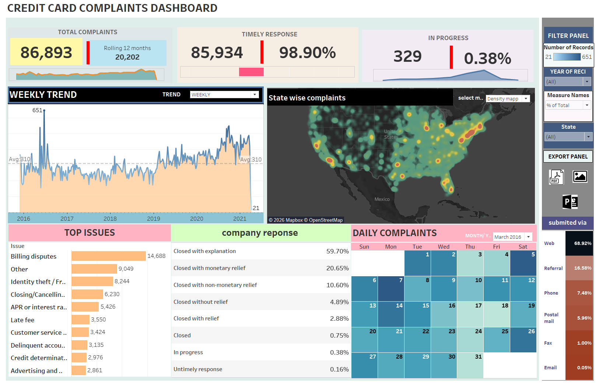

# 💳 Credit Card Complaints Analysis Dashboard — Tableau

An interactive **Tableau dashboard** developed to analyze credit card customer complaints, identify complaint trends, evaluate issue categories, and generate meaningful business insights through data visualization.

---

## 📊 Dashboard Overview

---

## 🎯 Project Objective

The objective of this project is to analyze customer complaints related to credit card services and transform raw data into interactive visual insights using **Tableau**.

The dashboard helps identify:

- Complaint trends
- Complaint categories
- Customer issues
- Consumer response patterns
- Business performance indicators
- Service-related challenges

---

## 📂 Dataset

**File:** `Credit Card Data_Set.csv`

The dataset contains customer complaint records associated with credit card services.

The dataset includes information such as:

- Complaint ID
- Complaint Category
- Complaint Status
- Consumer Response
- Company Response
- Submission Method
- Complaint Date
- Issue Type

---

## 📈 Analysis Covered

- Complaint Trend Analysis
- Complaint Category Analysis
- Consumer Response Analysis
- Company Response Analysis
- Complaint Status Analysis
- Issue-Based Analysis
- Time-Based Analysis

---

## 🔍 Key Insights

- Complaint patterns can be analyzed across multiple categories.
- The dashboard highlights the most frequently reported customer issues.
- Consumer and company responses can be compared to evaluate service effectiveness.
- Interactive visualizations help identify trends and business improvement opportunities.

---

## 🎛️ Interactive Dashboard

The dashboard includes interactive filters for:

- Complaint Category
- Complaint Status
- Consumer Response
- Company Response
- Issue Type

Users can dynamically explore complaint data to identify important patterns and trends.

---

## 🛠️ Tools & Technologies

- Tableau
- Microsoft Excel
- CSV
- Data Cleaning
- Data Transformation
- Data Visualization
- Business Intelligence

---

## 📁 Project Structure

| File / Folder | Description |
|---|---|
| `README.md` | Project documentation |
| `CREDIT CARD COMPLAINTS.twbx` | Tableau dashboard and visualization workbook |
| `Credit Card Data_Set.rar` | Source dataset containing customer complaint records |
| `Credit-Card-Complaints-Dashboard.png` | Main dashboard preview image |

---

## 📚 Skills Demonstrated

**Tableau • Data Analysis • Data Visualization • Business Intelligence • Dashboard Development • Data Cleaning • Analytical Reporting • Consumer Complaint Analysis**

---

## 👤 Author

### Aryan Gupta

**Data Analyst | Business Intelligence | Tableau | Power BI | Python**

Building interactive dashboards and transforming raw data into meaningful business insights through data visualization.

---

## 🌐 Connect With Me

- 💼 [LinkedIn](https://www.linkedin.com/in/aryangupta-data)
- 💻 [GitHub](https://github.com/aryan1821)
- 📸 [Instagram](https://www.instagram.com/______aryan07______/)

---

⭐ **If you found this project useful, consider giving the repository a Star.**
